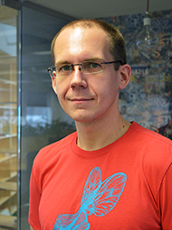

<ul class="flat">
    <a href="mailto:sander@saares.eu" title="Email"><i data-feather="mail"></i></a>
    <a href="https://github.com/sandersaares" title="GitHub"><i data-feather="github"></i></a>
    <a href="https://twitter.com/sandersaares" title="Twitter"><i data-feather="twitter"></i></a>
    <a href="https://www.linkedin.com/in/sandersaares/" title="LinkedIn"><i data-feather="linkedin"></i></a>
</ul>

Since 2008 I work at [Axinom](https://axinom.com), a company that creates solutions for in-flight entertainment and online streaming. In my role as advisor I deal with a wide range of topics including:

* technical product design and information architecture
* designing modern adaptive streaming workflows, from encoding and packaging to delivery and player integration
* achieving Hollywood-grade content security in line with [MPAA best practices](https://www.mpaa.org/what-we-do/advancing-creativity/additional-resources/#content-protection-best-practices)
* contributing to industry specifications on media streaming technologies
* understanding performance bottlenecks and optimizing systems on architecture, operating system, database and algorithm levels
* mentoring colleagues in applying modern techniques and practices
* exploratory research and development

I am the maintainer of the [prometheus-net](https://github.com/prometheus-net/prometheus-net) metrics library, which I use in my daily work. [Prometheus](https://prometheus.io) is a great solution for monitoring and metrics that often I use in order to obtain a deep understanding of the information systems I work with.

On my free time, I enjoy consuming books and practice cycling and archery. I believe the future of humanity is in the wide open spaces between planets and am an avid fan of the heavy-lift spaceflight industry that can open the door to our destiny. I wish I could contribute more to that industry but it falls rather far from my skillset so I remain a bystander.

This website is a collection of thoughts that I feel like sharing, thoughts that may prove useful to someone. The set of topics is fairly arbitrary, though I try to curate it a bit for easy readability.

BD3D282C75
